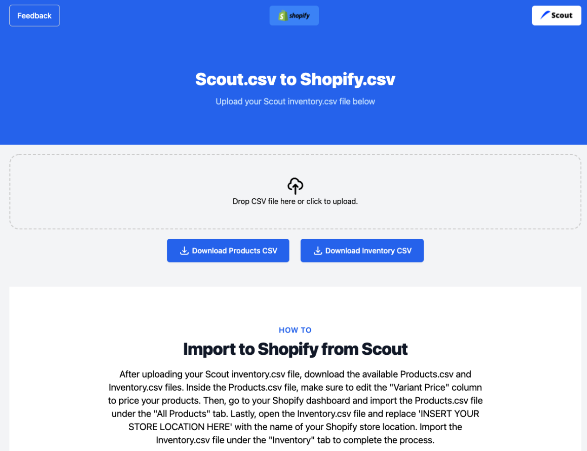
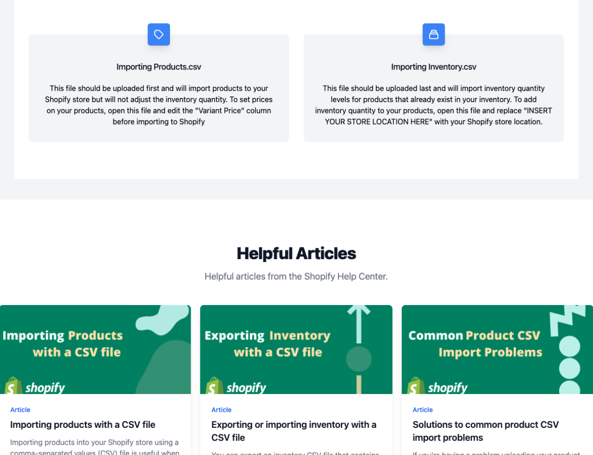

<h1 align="center">
   
  
   
  Scout to Shopify Converter
   
</h1>

<h4 align="center">Convert Inventory.csv exports from Scout to Product.csv files for Shopify.</h4>

 <a href="#screenshots">Screenshots</a> •
  <a href="#demo">Demo</a> •
  <a href="#key-features">Key Features</a> •
  <a href="#Built-with">Built With</a>

## Screenshots

## Demo

* View [here](https://scout2shopify.vercel.app/)

## Key Features

* Convert inventory stored in Scout into Shopify's product.csv file format 

## Built With

* JavaScript
* Next.js
* Tailwind CSS
* Vercel

